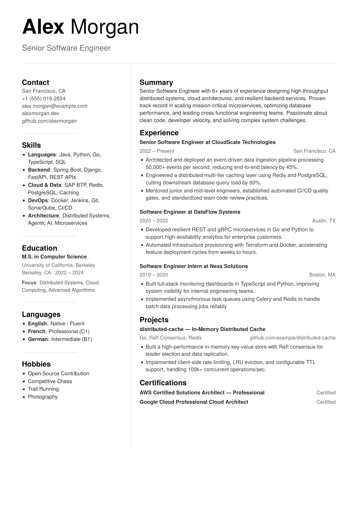

# Minimal ATS Resume (LaTeX)

A clean, minimalist, pixel-calibrated two-column resume template written in LaTeX. 100% modular, ATS-compliant, and self-contained.

<p align="center">
  
</p>

## Highlights

- **ATS-Compliant**:
  - Sequential text extraction (reads Left Column completely, then Right Column — no cross-column scrambled lines).
  - Clean plain-text encoding with `Ligatures = NoCommon` (keywords like *traffic* and *effective* extract properly).
  - Standard section headers (`Summary`, `Experience`, `Education`, `Skills`, `Certifications`, `Contact`).
- **Fully Modular**: Keep your content organized. Edit personal data in `data/` without touching layout or styling code.
- **Self-Contained Fonts**: Includes **TeX Gyre Heros** (Neo-Grotesque / Helvetica) and **Poppins** in `fonts/`. Works out of the box with no system font installs.
- **Fast Standalone Build**: Compiles in ~2 seconds using **[Tectonic](https://tectonic-typesetting.github.io/)**.

## Project Structure

```
minimal-ats-resume/
├── main.tex                 # Layout coordinator
├── style.cls                # Class file: geometry, rules & fonts
├── preview.png              # Resume preview image
├── build.ps1 / build.bat    # 1-click build scripts
├── fonts/                   # Standalone OTF/TTF fonts
└── data/                    # Edit your resume content here:
    ├── header.tex           # Name & professional title
    ├── contact.tex          # Contact information
    ├── skills.tex           # Technical skills
    ├── education.tex        # Degrees & universities
    ├── hobbies.tex          # Languages & hobbies
    ├── summary.tex          # Professional summary
    ├── experience.tex       # Work history & bullet points
    ├── projects.tex         # Featured projects
    └── certifications.tex   # Certifications & status
```

## Quick Start

### 1. Build

```bash
tectonic main.tex
```
*Or run `.\build.ps1` (PowerShell) / `build.bat` (CMD).*

### 2. Customize

Edit the `.tex` files inside `data/` to add your information.

### 3. Font Options

- **TeX Gyre Heros** (Default): Classic clean Helvetica aesthetic.
- **Poppins**: Set `\setmainfont{Poppins}[Path=fonts/, Extension=.ttf, ...]` in `style.cls` to switch to Poppins.
